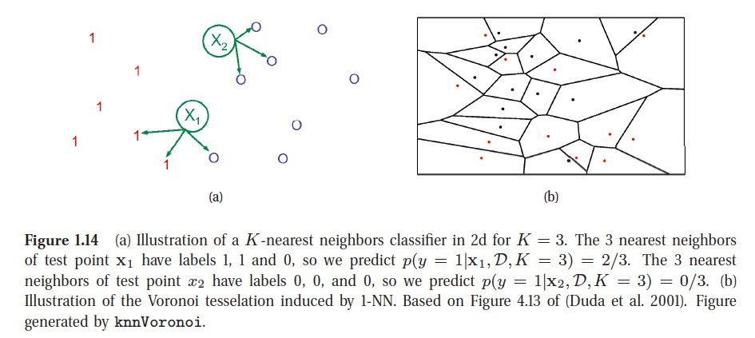

## Chapter 1

Page 1. We define **machine learning** as a set of methods that can automatically detect patterns in data, and then use the uncovered patterns to predict future data, or to perform other kinds of decision making under uncertainty.

Page 2. **Long tail**, means that a few things (e.g., words) are very common, but most things are quite rare

Three Types of ML:

- supervised learning approach;

- unsupervised learning approach: 

Page 13. Discovering graph structure.

Sometimes we measure a set of correlated variables, and we would like to discover which ones are most correlated with which others. This can be represented by a graph $G$, in which nodes represent variables, and edges represent direct dependence between variables.

NaN, which stands for **not a number**. The goal of imputation is to infer plausible values for the missing entries. This is sometimes called **matrix completion**.

page 16: Does the model have a fixed number of parameters, or does the number of parameters grow with the amount of training data? The former is called a parametric model, and the latter is called a **nonparametric** model(Maybe different with my previous understanding) .

**KNN** is illustrated in below picture. The KNN classifier is simple and can work quite well, provided it is given a good distance metric and has enough labeled training data. However, the main problem with KNN classifiers is that they do not work well with high dimensional inputs due to the **curse of dimensionality**.

Choosing K for a KNN classifier is a special case of a more general problem known as model selection, where we have to choose between models with different degrees of flexibility. Cross validation is widely used for solving such problems.

There is no universally best model, this is sometimes called the no free lunch theorem (Wolpert 1996). The reason for this is that a set of assumptions that works well in one domain may work poorly in another.

- reinforcement learning 

## Chapter 2

One simple but powerful alternative to compute the distribution of a function of an rv is as follows. First we generate $S$ samples from the distribution, we can approximate the distribution of $f(X)$ by using the empirical distribution. This is called a Monte Carlo approximation. The accuracy of an **MC approximation** increases with sample size.

**Information theory** is concerned with representing data in a compact fashion (a task known as data compression or source coding), as well as with transmitting and storing it in a way that is robust to errors (a task known as error correction or channel coding).

The **entropy** of a random variable $X$ with distribution $p$, denoted by $H(X)$, is a measure of its uncertainty. The discrete distribution with maximum entropy is the uniform distribution, Conversely, the distribution with minimum entropy (which is zero) is any delta-function that puts all its mass on one state. Such a distribution has no uncertainty.

One way to measure the dissimilarity of two probability distributions, $p$ and $q$, is known as the Kullback-Leibler divergence (**KL divergence**) or relative entropy. The KL divergence is not a distance, since it is asymmetric. One symmetric version of the KL divergence is the Jensen-Shannon divergence.

**MIC** (maximal information coefficient) has been called a correlation for the 21st century.

