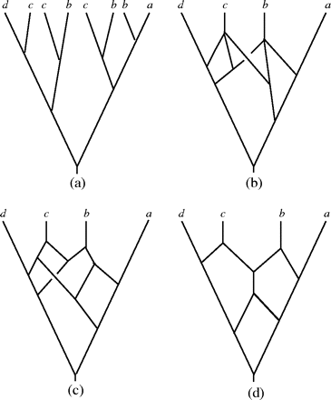
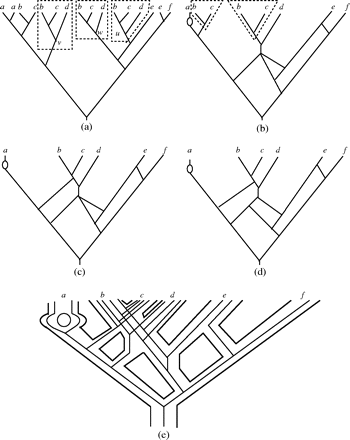

<!-- The file analysis/chunks.R contains chunks that define default settings
shared across the workflowr files. -->
```{r read-chunk, include=FALSE, cache=FALSE}
knitr::read_chunk("chunks.R")
```

<!-- Update knitr chunk options -->
```{r knitr-opts-chunk, include=FALSE}
```

<!-- Insert the date the file was last updated -->
```{r last-updated, echo=FALSE, results='asis'}
```

<!-- Insert the code version (Git commit SHA1) if Git repository exists and R
 package git2r is installed -->
```{r code-version, echo=FALSE, results='asis'}
```

<!-- Add your analysis here -->
Polyploid species played a major role in the evolution of plants. In this paper, we focus on present all possible phylogenetic networks from a multilabeled tree that are guaranteed to have minimal number of interaction nodes.


*Figure 2 from original paper*


Based on Fig.2 in this paper, we can see (b)(c)(d) are all phylogenetic networks that exhibit (a), however, we will use efficient algorithm to draw a phylogenetic network like (d) rather than (b) and (c).

From Fig.3 in this paper, we can see subtrees $T_{(u)}$,$T_{(v)}$ and $T_{(w)}$ are maximal inextendible. Fours useful concepts are subtree, equivalent, inextendible and maximal inextendible. In fact, we will focus on how to find maximal inextendible subtrees from a given MUL tree in actual algorithm. Note that the definition of **inextendible** is not clear for me, so I borrowed another one in the paper of [Huber KT and Moulton](https://link.springer.com/article/10.1007%2Fs00285-005-0365-z?LI=true) to get a better understanding this terminology. 

**inextendible**: suppose $T$ is MUL tree, for every vertex $v \in V(T)$ that is not the root of T we denote the parent of $v$ by $\bar v$, suppose $T'$ is a sub MUL tree with vertex $v$, we say  $T'$ is **inextendible** if there existed another sub MUL tree $T''$ with root vertex $w$ so that $T''$ is isomorphic to $T'$, and $T(\bar v)$ is not  isomorphic to $T(\bar w)$.


*Figure 3 from original paper*

So there would be a ***contradiction*** in the statement of inextendible definition. Take a look at Fig.3 again, whether on earth each subtree having leaves labeled with ``b`` and  ``c`` is inextendible or not ?

The core of this algorithm showed in Fig.4 is to merge and prune maximal inextendible subtrees and its equivalent subtrees, this process is repeated until a network is obtained that contains no repeated labeled leaves.Unfortunately, I could understand how do they find the maximal inextendible subtrees by height list $H$ and code $c(v)$ in the initial step.

A noticeable limitation is when MUL tree contains polytomies showed in Fig.6,using this presented constructing methods would lead to several different phylogenetic networks.
