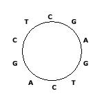

<!-- The file analysis/chunks.R contains chunks that define default settings
shared across the workflowr files. -->
```{r read-chunk, include=FALSE, cache=FALSE}
knitr::read_chunk("chunks.R")
```

<!-- Update knitr chunk options -->
```{r knitr-opts-chunk, include=FALSE}
```

<!-- Insert the date the file was last updated -->
```{r last-updated, echo=FALSE, results='asis'}
```

<!-- Insert the code version (Git commit SHA1) if Git repository exists and R
 package git2r is installed -->
```{r code-version, echo=FALSE, results='asis'}
```

<!-- Add your analysis here -->
RDP4 is the latest version of recombination detection program in a set of aligned sequences. RDP4 could not do multiple sequence alignment, but from its instruction manual, it provides three reliable sequence alignment tools: ClustalX/W, MUSCLE, POA for small, medium and large datasets respectively(small means fewer than $100$ sequences, large means more than $100$ sequences).


### **1. Firstly, we need to compile a good dataset.**

Although there is no formula to tell us the optimal numbers and lengths of sequences for optimal recombination detection, some procedures are needed to ensure a reasonable good dataset. 

### **2. Next step is to make a good alignment, which is essential for recombination analysis.**

It is not recommended that any pair of sequences share less than 60% nucleotide sequence identity, ideally this value is greater than 70%. Multiple sequence alignment tools will occasionally make some alignment errors, that's why we need to realign subsections of alignment to rectify these errors.

In general, after making a preliminary alignment of the sequences, if these are small sequences, we could use an alignment editor such as MEGA or IMPALE to check the accuracy of completed alignment by eyes, if they are large datasets, using the sub-sequence realignment tool in MEGA or IMPALE with different alignment parameter settings. It is strongly recommended that any unalignable (or just barely alignable) tracts be either deleted from the alignment or shifted/staggered.

### **3. Prelimnary  scan.**

We can click ``open`` and load alignment files, RDP4 could recognize these different file formats: FASTA, PHYLIP, GDE, CLUSTAL, GCG,NEXUS,MEGA, DNAMAN, .pdb. After general settings, click ``Run`` button in the command button panel.

We need to set up some parameters before general scanning. First one is to specify whether the sequence being examined is linear or circular. The following picture 1 is an example of circular sequence.


*Figure 1 originally from Chinese [website](http://blog.csdn.net/wsnbb123456789/article/details/49102521)*


We always read a circular sequence in the clockwise direction, then it should be "CGAGTCAGCT" in the above example. Of course there can be many linear sequences that are obtained from such a circular sequence, by cutting any place of the circular sequence. 

Move to  ``Analysis Sequences Using`` in  ``general`` button, it is strongly recommended to use the default setting. Pay attention to the Botscan and Siscann, there are two boxes in front of it separately. By default these two will automatically check the recombination signals detected by other methods,if we click the first box, then it will force their use to explore new signals, but be warned that it will increase analysis time dramatically. By the way, LARD method is also only used for checking signals and suitable for less than pretty small dataset (less than 20 sequences).

After general settings, click ``Run`` button in the command button panel.

### **4. Refine Preliminary recombination.**

It is important to be aware that RDP4 can get things horribly wrong, such as inaccurate identification of breakpoint positions. Unfortunately, there is no automated tools to judge whether our results are true.

In order to check the accuracy of estimation breakpoints estimation, best graphs are shown in the bottom left panel by choosing ``Check using`` ``MAXCH``and ``CHIMER``. Breakpoints are displayed in the peak of these two curves. However, if the peaks doesn't match the border of recombinant, this doesn't mean this inferred positions are wrong, it does mean there is a degree of uncertainty regarding this position. By the way, considering ``Confirmation Table`` in Recombination Info at top right panel is also a good way to assess the accuracy of estimation.

Remember this program could crash at any time so we should regularly save our results. 


