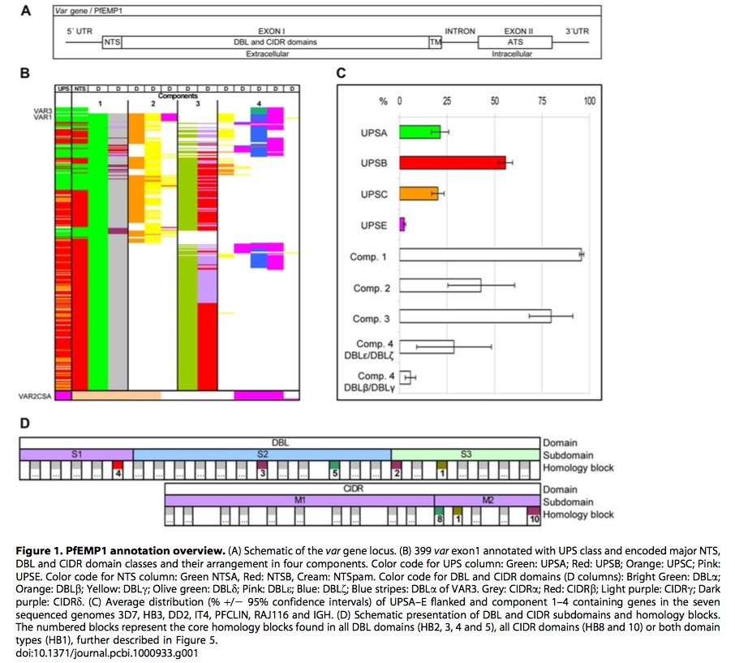
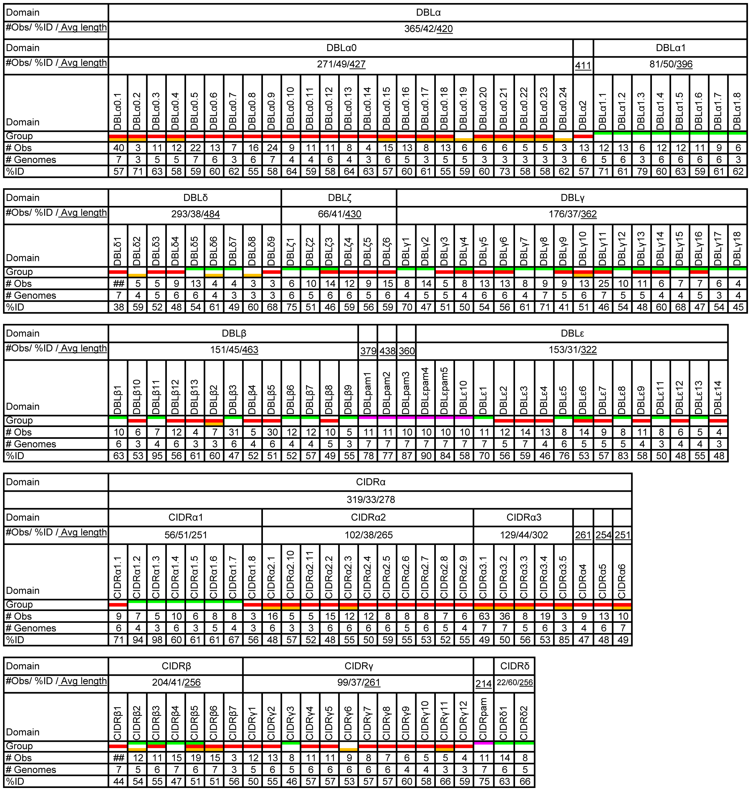
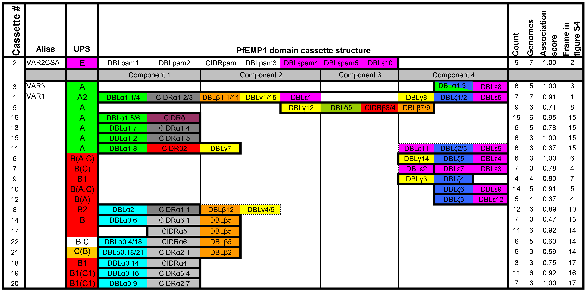
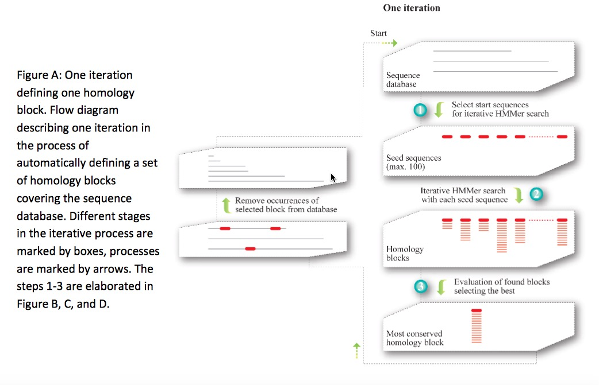

<!-- The file analysis/chunks.R contains chunks that define default settings
shared across the workflowr files. -->
```{r read-chunk, include=FALSE, cache=FALSE}
knitr::read_chunk("chunks.R")
```

<!-- Update knitr chunk options -->
```{r knitr-opts-chunk, include=FALSE}
```

<!-- Insert the date the file was last updated -->
```{r last-updated, echo=FALSE, results='asis'}
```

<!-- Insert the code version (Git commit SHA1) if Git repository exists and R
 package git2r is installed -->
```{r code-version, echo=FALSE, results='asis'}
```

<!-- Add your analysis here -->

Researchers analysis 399 var sequences (number varies from 39 to 63)from seven P.falciparum genomes (3D7,HB3,DD2,IT,IGH,RAJ116 and PFCLIN), including four Asian, two African and one Central American isolate. Authors redefine and reassess the identification and classification of var genes. In addition, a novel iterative homology detection method is proposed and is potentially applicable any other compositional analysis for protein or gene families.


*This graphic is adapted from original paper*

Figure1.A is a schematic representation of structure of var gene locus. It begins $5'$UTR  and ends $3'UTR$. It has two exons, containing the combination of DBL and CIDR domains  and ATS respectively. It also has NTS and TM region. Distance tree analysis confirmed the grouping of DBL into six major classes($\alpha, \beta,\gamma, \delta,\epsilon$ and $\zeta$) and cysteine rich interdomain regions(CIDR) of five   
different classes($\alpha, \beta, \gamma,\delta$ and $pam$). NTS sequences are divided into three classes, NTSA, NTSB and NTSpam while ATS sequences are divided into ATSA, ATSB, ATSPAM, ATSvar1, and ATSvar3. Moreover, UPS could be identified with these subgroups: UPSA1-2,UPSB1-4,UPSC1-2,UPSE, and additional UPSA3, UPSB5-7. var 1, var 3 and var2csa are three most conserved var genes, and UPSE only is found in var2csa, shown in Figure1.C.  

From Figure1.B, we could see there are four components in these var genes, among them, component 1(DBL$\alpha$ and CIDR$\alpha$) occurs $~95\%$ of var genes, follows with component 3.

Based on Figure1.D, DBD domain is divided into three structural subdomains, and CIDR is divided into two subdomains(previously studies show three subdomains). The numbered blocks represents the core homology blocks in all DBL (HB2,3,4,5)and CIDR domains(HB1,8) or both domain(HB1).


*This graphic is adapted from original paper*

Figure 2 tells us the basic composition and other information about each subdomain in DBL and CIDR. Regarding average sequence length, DBL has much longer sequences than CIDR significantly, regarding observation values, whole observation values between DBL and CIDR are similar.  One noteworthy point is most of the $DBL\delta$ sequences could not be subclassified, same as $CIDR\beta$. In addition, most classes could be linked to one specific UPS class. 

In conclusion, this classification is based on domain similarities averaged over the whole domains. The validity of the classification must be experimentally tested further.


*This graphic is adapted from original paper*

A PfEMP1 domain cassette is defined as a var gene sequence encoding two or more DBL or CIDR domains with subclasses that could be predicted from each other. The three conserved var genes var 1, var 3 and var2csa , all encoding unique DBL domains,  are present in all seven genomes, except var 3 which is not in HB3 and IGH. The domain composition variation within these three genes highlight the importance of ectopic recombination for the generation of PfEMP1 diversity.

Result also shows there is no basic difference between  PfEMP1 repertoires around the world. Var2CASA and its relevance in pregnancy malaria is well established, apart from that , some studies emphasize the importance of group A PfEMP1 in severe malaria, and often the particularly group A domain cassette 5.

## Novel iterative homology detection method

This method is potentially applicable to any other protein dataset, and would be suitable for compositional analysis of other frequently recombining gene families. Homology blocks(HB) cover on average 83% of a PfEMP1 sequence. The HB analysis also revealed a recombination hotspot between subdomain S2 and S3 in DBL domains (around HB2). The homology blocks were numbered according to the frequency in the seven genome dataset, with the most frequent being HB number one.

[VarDom server](http://www.cbs.dtu.dk/services/VarDom/) provides a chance to classify related homology blocks and domains after submitting a new sequence into it.

Actually writer also mention the composition of HBs in DBL, CIDR, NTS and ATS, I am not that interested, especially when they introduce the crystal structure of this genes.

Let's focus on the novel iterative homology detection method:

A serial iterative approach was employed, where per iteration could generate only one homology block, the most conserved sequence in the database. Subsequently the members of the selected homology block were removed from the database to avoid overlap in the following iteration. Three steps are implemented to uncover the most conserved homology block:

(1) Up to 100 different seed sequences were roughly selected using BLAST, each to potentially form a homology block. Ungapped BLAST was initially used to select seed sequences. These seed sequences should only cover one homology block each. Then normal gapped BLAST was used to detect homology which had escaped from the ungapped BLAST.

(2) Starting from a single query sequence selected in step 1. HMMs were built by iterative HMMer [(iHMMer)](http://hmmer.janelia.org/) algorithm using the HMMer package. The results from iHMMer consists of a multiple sequence alignment defining an HMM, where the HMM can refind the exact definition sequences.

(3) One optimized homology block was finally selected, by taking into account both the number of hits as a measure of conservation, but also how many times the same block occurred, as a measure of how well parameter space had been sampled for that specific homology block, and thus how likely it was that the block was optimal.


*This graphic is adapted from text S2 in original paper's supporting materials*
