<!-- The file analysis/chunks.R contains chunks that define default settings
shared across the workflowr files. -->
```{r read-chunk, include=FALSE, cache=FALSE}
knitr::read_chunk("chunks.R")
```

<!-- Update knitr chunk options -->
```{r knitr-opts-chunk, include=FALSE}
```

<!-- Insert the date the file was last updated -->
```{r last-updated, echo=FALSE, results='asis'}
```

<!-- Insert the code version (Git commit SHA1) if Git repository exists and R
 package git2r is installed -->
```{r code-version, echo=FALSE, results='asis'}
```

<!-- Add your analysis here -->
## Basic concepts
Reassortment is the mixing of the genetic material of a species into new combinations in different individuals. It is particularly used when two similar viruses that are infecting the same cell exchange genetic material.

There are several interesting concepts in graph theory. Please look at the Figure 1.1, 1.2 and 1.3.

- The **degree**of node $u$ is the sum of its indegree and outdegree.

-  A **biconnected components** is the maximal subgraph that is induced by set of edges and doesn't contain a cut node. A good example is in Figure 1.3.

- A graph $G=(V,E)$ is called **bipartite** if and only if its set of nodes can be partitioned into subsets $V_{1}$, $V_{2}$,with $V=V_{1}\cup V_{2}$ and $V_{1}\cap V_{2}=\emptyset$, such that for every edge $e \in E$,one of the endpoints lies in $V_{1}$, another endpoint lies in $V_{2}$.
Explain Exercise 1.2.3.

-  Two nodes $v$ and $w$ are **imcomparable**, if neither node is lower than other; similarily, two edges $e$ and $f$ are imcomparable if neither is lower than other;

- Different **traversals** give rise to different orders in which nodes are examined. Pay attention to preorder, postorder and breadth-first traversal in Figure 1.7.
In particular, breadth-first traversal, please see reference [here](https://baike.baidu.com/item/??/9796023?fr=aladdin).


PS: Nodes are also called vertices, edges are also called branches or arcs.
       Bifurcating Tree = Resolve Tree = Binary Tree
       
Let $\chi=\left\{x_{1},x_{2},...x_{n} \right\}$ be a set of taxa, a **cluster** is any subset of $\chi$,excluding the empty set $\emptyset$ and full set $\chi$. The ultimate goal of phylogenetic analysis is to compute a set of clusters on 
$\chi$ such that each cluster is monophyletic(also called clade. Monophyletic group contains all descendants of the common ancestor and the ancestor itself).

A **split** is any bipartitioning of $\chi$ into two non-empty subsets $A$ and $B$ of $\chi$, such that $\chi=A \cup B$ and $A\cap B=\emptyset$.

In phylogenetic analysis, a set of taxa $\chi=\left\{x_{1},x_{2},...x_{n} \right\}$ is often represented by a set of molecular sequences $A=\left\{a_{1},a_{2},...a_{n} \right\}$ where $a_{i}$ comes from taxon $x_{i}$ and correspond to some specific genes or locus. We also need to ensure that the sequences are ***homologous***, that is, have evolved from a common ancestor sequence.

In **Pairwise sequence alignment**, with the help of substitution matrix, for example the BLOSSUM matrix, which assigns empirically score, we could calculate the score of each pair of residues and then sum over scores among all pairs would be the score of whole alignment.

Sequence are often aligned by inserting gaps into each sequence shown in Figure 2.6 such that all sequences have same length $m$, forming a **multiple sequence alignment ** of length $m$. Our goal is to find a multiple sequence alignment that achieves the optimal score according to an appropriate score scheme. *Progressive method* as a heuristic approach, is used to align multiple sequences, its outline is shown in Figure 2.7. The core is to align a pair of similar sequences into *profiles*, then align profiles into final multiple sequence alignment.

Let $M$ be a multiple sequence alignment on $\chi$, each column of $M$ is called a character, each symbol that occurs in this column is called a character state.

## Phylogenetic trees
Now we are introducing some basic concepts and main methods for inferring phylogenetic trees.

Phylogenetic trees are usually computed from molecular sequences. They not only could uncover the relationship between different species or taxa, but also have many other applications. For instance, they are used to determine the age and the rate of diversification. In sequence-analysis method, they are allowed  **phylogenetic footprinting**.

In practice, there are two types of analysis after the initial multiple sequence alignment: distance-based analysis and sequence-based one. Its outline is shown in Figure 3.1 at page 24.

### Definition Phylogenetic Tree

Given a set of taxa $\chi$, this is a phylogenetic tree $T=(V,E)$ , its all nodes have degree $\neq$ 2, together with a taxon labeling $\lambda:\chi\to V$that assigns actually one taxon to every leave and none to internal nodes.

From a theoretical and algorithmic point of view, unrooted phylogenetic trees are much more easier than rooted ones, however, in biology, rooted phylogenetic trees are usually more of interest. A phylogenetic tree is called an edge-weighted tree if we are given a map $\omega$ that assigns a non-negative weight or length $\omega(e)$ to every edge e of the tree. In drawings, we usually use length of the edge to indicate the scale rather than write the lengths explicitly next to edges. 

Jukes-Cantor model tells us the probability formula of change during time $t$ or along the edge, given the mutation rate. This model of DNA evolution assumes the fours bases (A,C,G and T) occur with equal frequencies(0.25) and change from one base to another occurs at the same rate. If we relax the conditions, for example, let the bases occur at different and arbitrary rates (although they have to sum to 1), change rates in transitions and transversions, then we could get more generate model, anyway, they are both special cases of general time reversible model. 

Classical phylogenetic trees construction approaches consist of two following types:

- **Sequence-based method** usually searches for best phylogenetic tree which can optimally explain the given multiple sequence alignment $M$. We discuss the three main approaches about it: maximum parsimony, ML and Bayesian inference.
- **Distance-based method** usually constructs phylogenetic tree from a given a distance matrix $D$.

### Maximum parsimony
Maximum parsimony method is to look for a phylogenetic tree that explains the given set of aligned sequences using a minimum number of evolutionary events.  

The *parsimony score* of $T$(tree) and $M$(given multiple sequence alignment) is defined as:  

\begin{equation}
P S(T, M)=\min_{\alpha}\sum_{\left\{x,y\right\}}diff(x,y)
\end{equation}
where diff() function is known as *hamming distance* between sequence $x=(x_{1},x_{2},...x_{m})$and sequence $y=(y_{1},y_{2},...y_{m})$ that describes the difference of $x$ and $y$
\begin{equation}
diff(x, y)=| \left\{ i | x_{i}\neq y_{i} \right\} |
\end{equation}

The minimum is taken over all possible assignments $\alpha$ that make the sequences of length $m$ to be the internal nodes, summation is taken over all possible pairs of $x$ and $y$ that are assigned at opposite end of edge of $T$ .

This task of computing parsimony score is  the known *small parsimony* problem. In small parsimony problem, input is aligned sequences and a tree with sequences at leaves, output is an sequences assignment of all internal nodes in this tree with minimum number of changes across all edges. For bifurcating tree, *Fitch algorithm* is used to calculate efficiently, in more general settings, *Sankoff's algorithm* can be applied. 

Let's describe Fitch algorithm which has a linear time when solving above small parsimony problem. Assume we are given a multiple sequence alignment $M$ and a bifurcating tree $T$ on  $\chi$, we need to score each character (that is, column of the alignment)separately, and then obtain the parsimony score $P S(T, M)$ by summing over all characters.

This algorithm proceeds in two parts, as shown in following pictures. The first part is called *bottom up* phrase, from leaves to root, finding sets of possible ancestral states (labels) for each internal node, next part is *top down* process, from root to leaves, determining ancestral states (labels) for internal nodes. Different site is independent, so we can solve one site at a time. 


On the contrary, there is *big parsimony*(called large parsimony also). It's related with a search through the space of trees. In big parsimony problem, input is only aligned sequences, output is a labeled tree with minimum number of changes across all edges (over all trees). It is a NP hard problem.


### Bayesian methods 
Bayesian inference employs MCMC to sample from the posterior probability distribution. Posterior probability distribution in phylogeny inference is the conditional probability of T given input dataset. Each step, Metropolis-Hastings algorithm is used here, each step we propose a modified new tree topology, then accept it with the probability of $min(1, \alpha)$, $\alpha$ is the ratio of new prior times transition kernel divide the old one, otherwise, we reject and still use the current one. Therefore, a suitable modification of this proposed new tree should be taken into account with care. After discarding the burn in, sometimes we would also do sparsely sampling from output a series of trees, retaining only 1000th tree, say, in order to avoid the problem of autocorrelation, since the samples the not independent in this case. Let's talk about the modification in detail.  

The first one is called *local algorithm*, which is a modification of NNI(Nearest neighbor interchange). This algorithm is very magic and powerful. Through  a path in a tree, then update length of different nodes and even topology by introducing random number. Regarding parameters in evolutionary model, like mutation rate $\mu$ in Jukes Cantor model, are modified by adding a random number uniformly chosen from an appropriate interval centered at 0. For a set of parameters that is constrained to sum to some specific value, such as 1 in the case of probabilities, the values are randomly modified according to a Dirichlet distribution.  

Modifying the tree and proposal for new parameters are generated independently and simultaneously, and then accept or reject by a single Metropolis-Hastings ratio.  

The second one is called *Metropolis-coupled MCMC* or ($MC^3$) , this is a variant of MCMC which are suitable if there are a large amount of parameters. The first chain $Z_{1}$ is called cold chain, other chains $Z_{2},...Z_{K}$ are called heated chains, all chains are run parallel. After all chains have moved one step, Let $T_{i}$ denote the current state of all chains, for all i =1 ,2 ... K, then after randomly choosing two chains $Z_{i}$ and $Z_{j}$, swap the result with specific probability. Swapping of chains can help the cold chains to move a new part of of parameter space that it may have difficulty in reaching. At the end of run, discard all heated chains and cold chain is processed as before.  

A challenge here is we may not know whether this chain has converged. Two approaches are introduced here: one is to monitor whether there there is no further increase in likelihood, another one is run multiple chains in parallel, to keep them running until appear to sample from the same distribution. In addition, areas like choosing prior distribution and check convergence is ongoing research.  


### Branch-swapping method
When researchers explore the bifurcating trees space, they actually move from one bifurcating tree $T$ to another bifurcating tree $T'$ by applying  *Branch-swapping method* to rearrange a part of tree $T$. There are three methods : NNI(Nearest neighbor interchange),SPR(Subtree prune and regraft) and TBR(Tree bisection and reconnection). In order to show this three methods vividly, please look at the figures 3.14-3.16 which are all from this book. Let NNI(T), SPR(T) and TBR(T) represent the set of all possible trees that can be obtained by applying NNI,SPR and TBR respectively. It is not difficult to note that:

\begin{equation}
NNI(T) \subseteq SPR(T) \subseteq TBR(T)
\end{equation}

Each of these three methods could be used to define distance of two phylogenetic trees. For example, the SPR distance of two trees is minimum number of SPR operations necessary to transform from one tree into another.


*Figure 3.14-16 are all from original paper*

### Bootstrap analysis

In order to evaluate the robustness of estimated phylogenetic tree, bootstrapping is employed. Given a multiple sequence alignment $M$ of length $m$ and phylogenetic tree construction method, first step is to get bootstrap replicate $M'$ by randomly sampling from $M$ that consists of $m$ columns, with replacement, normally a set of 100 or 1000, noted $\left\{M^{1},M^{2},...M^{1000}\right\}$(say 1000), the method is applied in each replicate, producing a collection of phylogenetic trees $B=\left\{{T^{1},T^{2},...T^{1000}}\right\}$, then use these trees to determine  bootstrap support of each split. In practice, a bootstrap support of at least 70%, is required for a split to be considered trustworthy.

### UPGMA and NJ

Neighbour-joining is the most popular method for computing the phylogenetic tree, viewed as a modification of UPGMA. In biology, molecular clock hypothesis states the mutation rate is constant over all sites of sequence and over all edges of the model tree. It implies that all leaves of tree all have same distance from the root. Actually, any tree produced by UPGMA algorithm has the property that all leaves have the same distance to the root. 

The steps of UPGMA are pretty easy to understand: given a set of sequences, first calculate a table showing the hamming distance. Then merge the smallest distance in pairs of sequences to one cluster, creating a new node. After that, calculate the new distance table again. UPDMA is assembled bottom-up.

Neighbour-joining doesn't need to assume a molecular clock like UPGMA. Its output is an unrooted tree. One difference between UPGMA and NJ is how to update the distance matrix after merging two clusters. The formula when computing the distance between a new cluster and one merged cluster is different(Look at figure 3.21). In UPGMA, the last term "$-d(C_{i},C_{j})$" is not needed.

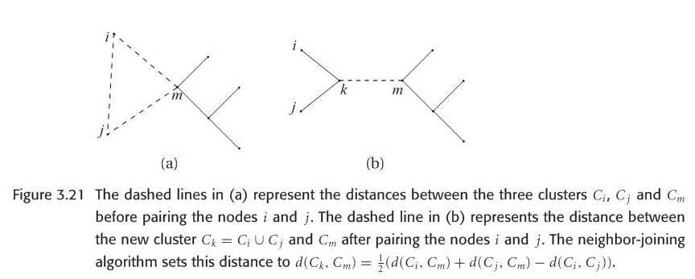

Another significant difference between UPGMA and NJ is how the length of edges are set, formula in terms os computing the distance between a leave and merged node is in following figure 3.22. In summary, based on these formula, we could recalculate the length of each branch in model tree, the direct difference when looking at UPGMA and NJ trees is the giant different in each branch length.  

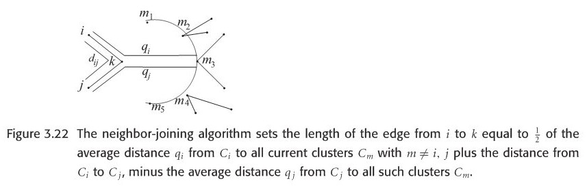

However, we need to note that one disadvantage using NJ algorithm is that it may produce negative branch length, which happens quite frequently.


### Balanced minimum evolution 

A new and faster algorithm called FastME is proposed recently based on balanced minimum evolution(BME) framework, which could provide more accurate trees than NJ and never produce negative edge lengths.

Given a distance matrix and an unrooted bifurcating tree topology, we could calculate the leave edge and internal edge length based on clear formulas and total tree length is given as well, in other words, calculating BME tree is a statistically consistent tree construction method, however, finding the optimal BME tree is NP hard, so we turn to heuristics, more precise, FastME heuristic. It has two phases. First step is an initial tree is constructed , next step is to iteratively update the tree topology using NNI until no further improvement in the score of total tree length. Since it doesn't need to explicitly point out each branch length, that's why it is significantly faster than NJ in practice.

BME could be viewed as an improvement of classic minimum evolution problem. Moreover, it also consider the pairwise distance variance. In OLS method when constructing a tree, all distance have the same variance. But in general, it is not true,  the variance of larger distance tend to be larger. Actually, based on the formula of total length tree length, longer distance implies a smaller weight, therefore, BME can also be interpreted as a weighted least square method. FastME runs much faster than all previous weighted least square approaches.

When comparing the distance between two phylogenetic trees, generally the trees are unrooted ones. Robinson-Foulds distance and quartet distance is used when measuring the similarity for a pair of trees. Even though there are so-called NNI, SPR and TBR distances which determine the minimal number of related operations from one topology to another, computation is NP hard and is rarely used in practice.

### Consensus Tree

In general, when facing with a collection of different phylogenetic trees, producing from different methods given the same multiple sequence alignment like MLE , MP and so forth, or from Bayesian inference, *consensus method* is necessary used to obtain *consensus tree* that represents evolutionary history which different phylogenetic trees agree, in some sense. 

Here we introduce two kinds of consensus trees: strict consensus and majority consensus. Let $S_{strict}(T)$ denotes the set of all splits that occur in every tree in tree set. $S_{majority}(T)$ denotes the set of splits that occur in more than half of all trees in tree set. Here is an example figure to explain the strict and majority tree. In practice, majority consensus tree is more informative than strict consensus tree since the latter tends to be a star tree easily.

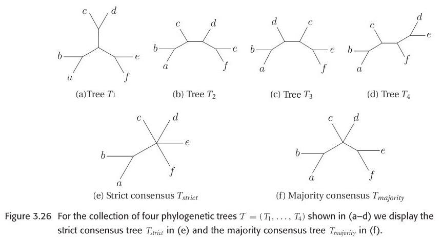

Newick format is used to describe a rooted phylogenetic tree, of course it is also used to describe unrooted tree by erasing the root. example is here: 
text="((t4:0.104381,(t2:0.075411,t1:0.075411):0.5):0.065840,t3:0.170221);"

If possible, you could try this R code to plot a tree and check whether it is consistent with mine as shown beside the code:

```{r}
library(ape)
tr1 <- read.tree(text= "((t5:0.161175,t6:0.161175):0.392293,((t4:0.104381,(t2:0.075411,t1:0.075411):0.028969):0.065840,t3:0.170221):0.383247);")
tr2 <- read.tree(text= "((t5:2.161175,t6:0.161175):0.392293,((t4:0.104381,(t2:0.075411,t1:0.075411):1):0.065840,t3:0.170221):0.383247);")
plot(tr1,font=1)
plot(tr2,font=1)
```


## Phylogenetic network
An overview of phylogenetic network is [here](https://qianfeng2.github.io/workflowr/Huson2011paper.html) 

Phylogenetic networks can be computed from wide range of datasets, including multiple sequence alignments, splits, distance matrices, set of trees, clusters, rooted triplets or unrooted quartets.

Newick  string could be extended to describe a rooted phylogenetic network. The method is to to assign formal labels $Hi$ to reticulate nodes, details could be in the following Figure 4.7. Conversely, if we are given a this kind of Newick format to construct a network, first step is to construct a rooted phylogenetic tree, then merge the same formal taxon $H$.

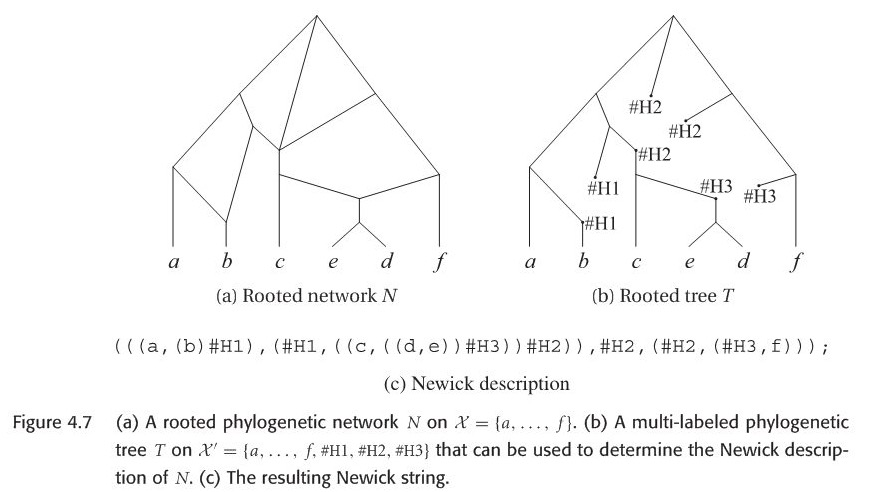


Since my PhD project is related with recombination network. Let's introduce this type.

Recombination network is a rooted network that describe the evolution of a set of sequences(usually come from different individuals) in terms of mutation(along the edges of branch), speciation events (at tree nodes) and recombination events (at reticulate nodes).

### Definition recombination network

Here is a formal definition of recombination network:

Let $M$ be a multiple alignment of binary sequences of length L, on $\chi$. A recombination network $N$ representing $M$ is given by a combining of rooted phylogenetic network on  $\chi$, together with two additional labelings:

(i)each node $v$ of $N$ is labeled by a binary sequence $\delta(v)$ of length L.

(ii)each tree edge $e$ is labeled by a set of positions $\delta(e) \subseteq \left\{1, 2,...L \right\}$.

These two labelings must fulfill the following compatibility conditions: 


* These sequence $\delta(v)$ assigned to any leaf $v$ must equal the sequence in M that is given for the taxon associated with $v$.
* If **r** is a reticulate node(often called recombination node) with parents v and w, then the sequence $\delta(r)$ must be **obtainable ** from $\delta(v)$ and  $\delta(w)$ by a crossover.
* If $e=(v, w)$ is a tree edge, then the set of positions at which two sequences $\delta(v)$ and  $\delta(w)$ differ must equal $\delta(e)$.

For computational reasons, the following condition is usually also required:

* Any given position may mutate at most once in the network. In other words, for any given position $i$, there exist at most one edge $e$ with $i \in \delta(e)$


Here we can verify this simple recombination network example, can the node $r$ be obtained by a single-crossover recombination from parental sequences?

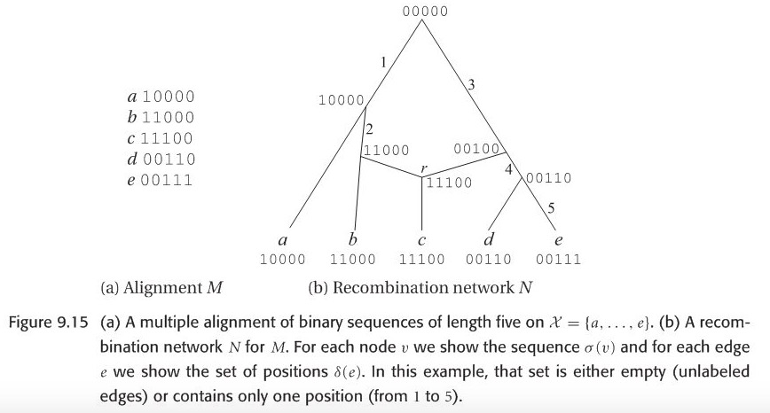

Evolution in the presence of recombination is usually studied in population genetics, rather than in phylogeny, focusing a statistical method , under the ``coalescent with recombination" model, a description of history from $n$ sampled sequences give rise to a graph called ancestral recombination graph(ARG).

In fact, evolutionary history of any sufficiently short segment of sequence is a rooted phylogenetic tree. Therefore, one natural and direct way is to construct a suitable rooted phylogenetic tree $T_i$ for each position $i$ in the alignment $M$, we call any such tree $T_i$ as \textbf{local tree}, then combine all trees into a suitable phylogenetic network $N$.

### Two impractical construction ways

Currently, there are two ways to construct phylogenetic network by these local trees:

* The local-tree parsimony approach
* A heuristic for the local tree approach

First in the local-tree parsimony approach, in the local-tree graph $G$ any path $P$ is defined as :

\begin{equation}
P=( v(1,T_{1}), v(2,T_{2}),... v(L,T_{L}))
\end{equation}

The total weight of such path is the summation of node weight and edge weight. node weight means the minimum number of substitutions required for the i-th character on the rooted phylogenetic tree, edge weight is the minimum number of reticulate nodes which links tree $T$ and $T'$, reflecting the recombination distance. Any two nodes $v(i,T)$ and $v(i+1,T')$ at adjacent positions in the alignment are corrected by a directed edge $e=(v(i,T), v(i+1,T'))$. 

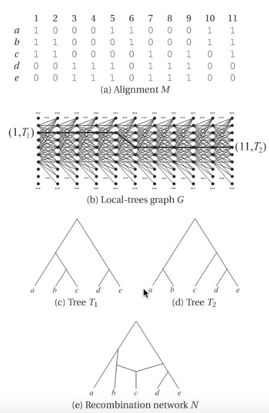


A *most parsimony* set of trees for $M$ is given by a path P of minimum weight, then recursion method could be used, see below:

\begin{equation}
W(i,T)=
\begin{cases}
min_{T'}{W(i-1,T')+w(v(i-1,T'), v(i,T))+w(v(i,T))}& \text{if i $>$1}\\
w(v(1,T))& \text{else}
\end{cases}
\end{equation}

An example is shown in the figure. Unfortunately, this method is not practical, since computing a suitable phylogenetic network representing all rooted trees in second part is an NP-hard problem, besides that, computation of edges weight is also NP-hard.


Next is the heuristic for the local tree approach.The first simplification is to use unrooted phylogenetic trees rather than rooted trees, main simplification is to consider a small part of full local tree graph.

The heuristic starts by computing a phylogenetic tree for $M$ using maximum parsimony method. Then we compute the SPR-neighborhood S of T that only one SPR modification of T, the main recursion is the same as previous section. The resulting set of trees might depend quite strongly on the initial tree, so once completing the first pass of this algorithm, a second pass is needed, start tree will be replaced by the tree from last position. However, this step is still challenging in practice.

### Computing recombination networks from binary sequences

Actually, in paper "Computing recombination networks from binary sequences" Daniel H.Huson 2005, researchers proposed a method to draw recombination network from aligned binary sequences. There are some important and meaningful concepts before the description of core algorithm. Let's first introduce these concepts.

**Splits** can be compatible, circular, and weakly compatible. The last one is of interest because these splits can be efficiently computed using split decomposition algorithm.

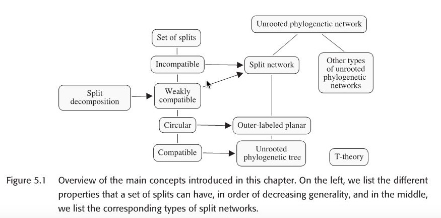

Here the term compatible, incompatible  and split network all occur in above mentioned paper.

Given the following unrooted phylogenetic tree, there are seven edges in this tree, it gives rise to seven split, called split encoding of $T$. Suppose we are given an arbitrary set of splits S, we would like to know whether S can be represented by some unrooted phylogenetic tree T with $S=S(T)$. The answer is given by compatibility theorem.

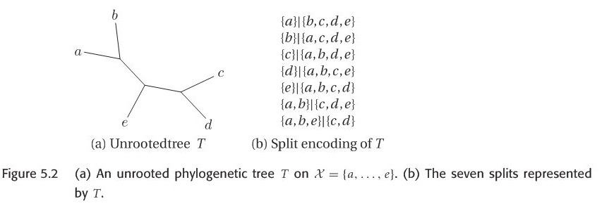

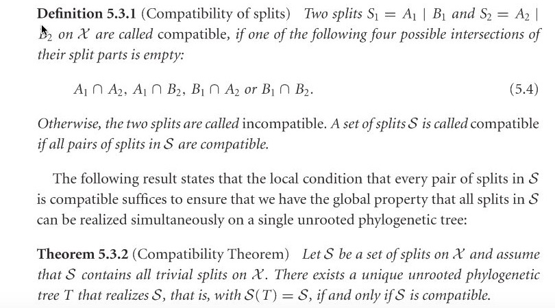


It is also useful to represent the incompatibilities among a set of splits S by a graph called *Incompatibility graph*, the formal definition is here:
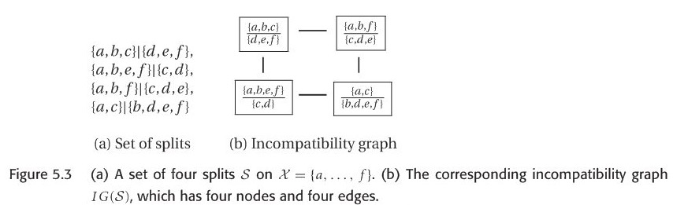

**Incompatibility graph**: The Incompatibility graph IG(S) of a set of splits S is the graph $(V,E)$ that has node $V= S$ and edge set $E=\left\{(s_{1},s_{2}) | s_{1}  and  s_{2}  are compatible\right\}$ , one example is shown in figure 5.3.  

From the definition of incompatibility graph, we could know that if one split in S is compatible with other splits in S, then this split will be isolated node in incompatibility graph.The formal definition of split network is shown below.

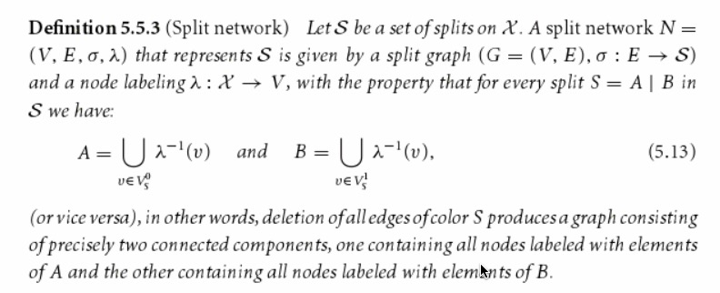

If we want to compare two split network $N_{1}$ and  $N_{2}$, we compare the corresponding set of splits $S_{1}$ and $S_{2}$, using the Robinson-Foulds distance:
\begin{equation}
d_{RF}(S_{1},S_{2})=\frac{|S_{1} \Delta S_{2}|}{2}
\end{equation}

Robinson-Foulds distance is also a proper metric for comparing tree distance.

Actually, there could be a tree or other graph to represent a same set of splits. There is also an important lemma: a set of splits are compatible if and only if there exists a split network N representing S that is a tree. Hence, given our input is a set of splits, how to construct a split network N as output is our first challenge. Below are two available approaches.

The first is the *convex hull algorithm* that computes the Buneman graph and can be applied to any set of splits, using an exponential number of nodes and edges in the worst case; the second is the *circular network algorithm* , which can be applied to any set of **circular** splits and produces an outer-labeled planar network with only a quadratic number of nodes and edges.

Both algorithms proceed in two steps. In the first step, all trivial splits in $S =\left\{ S_{1} , . . . , S_{m} \right\}$ are processed to obtain a star network consisting of a central node and one leaf per taxon, noted 
$S^{O}$ (outer). Then, in the second step, the remaining splits are inserted one by one , noted $S^{I}$ (inner) so as to obtain the final network.

