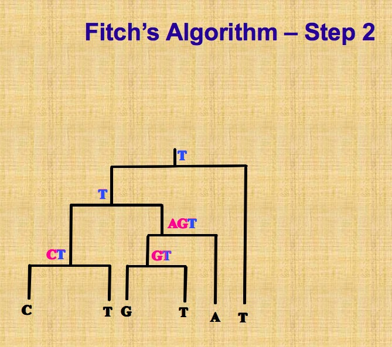

<!-- The file analysis/chunks.R contains chunks that define default settings
shared across the workflowr files. -->
```{r read-chunk, include=FALSE, cache=FALSE}
knitr::read_chunk("chunks.R")
```

<!-- Update knitr chunk options -->
```{r knitr-opts-chunk, include=FALSE}
```

<!-- Insert the date the file was last updated -->
```{r last-updated, echo=FALSE, results='asis'}
```

<!-- Insert the code version (Git commit SHA1) if Git repository exists and R
 package git2r is installed -->
```{r code-version, echo=FALSE, results='asis'}
```

<!-- Add your analysis here -->
## Basic concepts
Reassortment is the mixing of the genetic material of a species into new combinations in different individuals. It is particularly used when two similar viruses that are infecting the same cell exchange genetic material.

There are several interesting concepts in graph theory. Please look at the Figure 1.1, 1.2 and 1.3.

- The **degree**of node $u$ is the sum of its indegree and outdegree.

-  A **biconnected components** is the maximal subgraph that is induced by set of edges and doesn't contain a cut node. A good example is in Figure 1.3.

- A graph $G=(V,E)$ is called **bipartite** if and only if its set of nodes can be partitioned into subsets $V_{1}$, $V_{2}$,with $V=V_{1}\cup V_{2}$ and $V_{1}\cap V_{2}=\emptyset$, such that for every edge $e \in E$,one of the endpoints lies in $V_{1}$, another endpoint lies in $V_{2}$.
Explain Exercise 1.2.3.

-  Two nodes $v$ and $w$ are **imcomparable**, if neither node is lower than other; similarily, two edges $e$ and $f$ are imcomparable if neither is lower than other;

- Different **traversals** give rise to different orders in which nodes are examined. Pay attention to preorder, postorder and breadth-first traversal in Figure 1.7.
In particular, breadth-first traversal, please see reference [here](https://baike.baidu.com/item/??/9796023?fr=aladdin).


PS: Nodes are also called vertices, edges are also called branches or arcs.
       Bifurcating Tree = Resolve Tree = Binary Tree
       
Let $\chi=\left\{x_{1},x_{2},...x_{n} \right\}$ be a set of taxa, a **cluster** is any subset of $\chi$,excluding the empty set $\emptyset$ and full set $\chi$. The ultimate goal of phylogenetic analysis is to compute a set of clusters on 
$\chi$ such that each cluster is monophyletic(also called clade. Monophyletic group contains all descendants of the common ancestor and the ancestor itself).

A **split** is any bipartitioning of $\chi$ into two non-empty subsets $A$ and $B$ of $\chi$, such that $\chi=A \cup B$ and $A\cap B=\emptyset$.

In phylogenetic analysis, a set of taxa $\chi=\left\{x_{1},x_{2},...x_{n} \right\}$ is often represented by a set of molecular sequences $A=\left\{a_{1},a_{2},...a_{n} \right\}$ where $a_{i}$ comes from taxon $x_{i}$ and correspond to some specific genes or locus. We also need to ensure that the sequences are ***homologous***, that is, have evolved from a common ancestor sequence.

In **Pairwise sequence alignment**, with the help of substitution matrix, for example the BLOSSUM matrix, which assigns empirically score, we could calculate the score of each pair of residues and then sum over scores among all pairs would be the score of whole alignment.

Sequence are often aligned by inserting gaps into each sequence shown in Figure 2.6 such that all sequences have same length $m$, forming a **multiple sequence alignment ** of length $m$. Our goal is to find a multiple sequence alignment that achieves the optimal score according to an appropriate score scheme. *Progressive method* as a heuristic approach, is used to align multiple sequences, its outline is shown in Figure 2.7. The core is to align a pair of similar sequences into *profiles*, then align profiles into final multiple sequence alignment.

Let $M$ be a multiple sequence alignment on $\chi$, each column of $M$ is called a character, each symbol that occurs in this column is called a character state.

## Phylogenetic trees
Now we are introducing some basic concepts and main methods for inferring phylogenetic trees.

Phylogenetic trees are usually computed from molecular sequences. They not only could uncover the relationship between different species or taxa, but also have many other applications. For instance, they are used to determine the age and the rate of diversification. In sequence-analysis method, they are allowed  **phylogenetic footprinting**.

In practice, there are two types of analysis after the initial multiple sequence alignment: distance-based analysis and sequence-based one. Its outline is shown in Figure 3.1 at page 24.

### Definition Phylogenetic Tree

Given a set of taxa $\chi$, this is a phylogenetic tree $T=(V,E)$ , its all nodes have degree $\neq$ 2, together with a taxon labeling $\lambda:\chi\to V$that assigns actually one taxon to every leave and none to internal nodes.

From a theoretical and algorithmic point of view, unrooted phylogenetic trees are much more easier than rooted ones, however, in biology, rooted phylogenetic trees are usually more of interest. A phylogenetic tree is called an edge-weighted tree if we are given a map $\omega$ that assigns a non-negative weight or length $\omega(e)$ to every edge e of the tree. In drawings, we usually use length of the edge to indicate the scale rather than write the lengths explicitly next to edges. 

Jukes-Cantor model tells us the probability formula of change during time $t$ or along the edge, given the mutation rate. This model of DNA evolution assumes the fours bases (A,C,G and T) occur with equal frequencies(0.25) and change from one base to another occurs at the same rate. If we relax the conditions, for example, let the bases occur at different and arbitrary rates (although they have to sum to 1), change rates in transitions and transversions, then we could get more generate model, anyway, they are both special cases of general time reversible model. 

Classical phylogenetic trees construction approaches consist of two following types:

- **Sequence-based method** usually searches for best phylogenetic tree which can optimally explain the given multiple sequence alignment $M$. We discuss the three main approaches about it: maximum parsimony, ML and Bayesian inference.
- **Distance-based method** usually constructs phylogenetic tree from a given a distance matrix $D$.

### Maximum parsimony
Maximum parsimony method is to look for a phylogenetic tree that explains the given set of aligned sequences using a minimum number of evolutionary events.  

The *parsimony score* of $T$(tree) and $M$(given multiple sequence alignment) is defined as:  

\begin{equation}
P S(T, M)=\min_{\alpha}\sum_{\left\{x,y\right\}}diff(x,y)
\end{equation}
where diff() function is known as *hamming distance* between sequence $x=(x_{1},x_{2},...x_{m})$and sequence $y=(y_{1},y_{2},...y_{m})$ that describes the difference of $x$ and $y$
\begin{equation}
diff(x, y)=| \left\{ i | x_{i}\neq y_{i} \right\} |
\end{equation}

The minimum is taken over all possible assignments $\alpha$ that make the sequences of length $m$ to be the internal nodes, summation is taken over all possible pairs of $x$ and $y$ that are assigned at opposite end of edge of $T$ .

This task of computing parsimony score is  the known *small parsimony* problem. In small parsimony problem, input is aligned sequences and a tree with sequences at leaves, output is an sequences assignment of all internal nodes in this tree with minimum number of changes across all edges. For bifurcating tree, *Fitch algorithm* is used to calculate efficiently, in more general settings, *Sankoff's algorithm* can be applied. 

Let's describe Fitch algorithm which has a linear time when solving above small parsimony problem. Assume we are given a multiple sequence alignment $M$ and a bifurcating tree $T$ on  $\chi$, we need to score each character (that is, column of the alignment)separately, and then obtain the parsimony score $P S(T, M)$ by summing over all characters.

This algorithm proceeds in two parts, as shown in following pictures. The first part is called *bottom up* phrase, from leaves to root, finding sets of possible ancestral states (labels) for each internal node, next part is *top down* process, from root to leaves, determining ancestral states (labels) for internal nodes. Different site is independent, so we can solve one site at a time. 




On the contrary, there is *big parsimony*(called large parsimony also). It's related with a search through the space of trees. In big parsimony problem, input is only aligned sequences, output is a labeled tree with minimum number of changes across all edges (over all trees). It is a NP hard problem.


### Bayesian methods 
Bayesian inference employs MCMC to sample from the posterior probability distribution. Posterior probability distribution in phylogeny inference is the conditional probability of T given input dataset. Each step, Metropolis-Hastings algorithm is used here, each step we propose a modified new tree topology, then accept it with the probability of $min(1, \alpha)$, $\alpha$ is the ratio of new prior times transition kernel divide the old one, otherwise, we reject and still use the current one. Therefore, a suitable modification of this proposed new tree should be taken into account with care. After discarding the burn in, sometimes we would also do sparsely sampling from output a series of trees, retaining only 1000th tree, say, in order to avoid the problem of autocorrelation, since the samples the not independent in this case. Let's talk about the modification in detail.  

The first one is called *local algorithm*, which is a modification of NNI(Nearest neighbor interchange). This algorithm is very magic and powerful. Through  a path in a tree, then update length of different nodes and even topology by introducing random number. Regarding parameters in evolutionary model, like mutation rate $\mu$ in Jukes Cantor model, are modified by adding a random number uniformly chosen from an appropriate interval centered at 0. For a set of parameters that is constrained to sum to some specific value, such as 1 in the case of probabilities, the values are randomly modified according to a Dirichlet distribution.  

Modifying the tree and proposal for new parameters are generated independently and simultaneously, and then accept or reject by a single Metropolis-Hastings ratio.  

The second one is called *Metropolis-coupled MCMC* or ($MC^3$) , this is a variant of MCMC which are suitable if there are a large amount of parameters. The first chain $Z_{1}$ is called cold chain, other chains $Z_{2},...Z_{K}$ are called heated chains, all chains are run parallel. After all chains have moved one step, Let $T_{i}$ denote the current state of all chains, for all i =1 ,2 ... K, then after randomly choosing two chains $Z_{i}$ and $Z_{j}$, swap the result with specific probability. Swapping of chains can help the cold chains to move a new part of of parameter space that it may have difficulty in reaching. At the end of run, discard all heated chains and cold chain is processed as before.  

A challenge here is we may not know whether this chain has converged. Two approaches are introduced here: one is to monitor whether there there is no further increase in likelihood, another one is run multiple chains in parallel, to keep them running until appear to sample from the same distribution. In addition, areas like choosing prior distribution and check convergence is ongoing research.  


### Branch-swapping method
When researchers explore the bifurcating trees space, they actually move from one bifurcating tree $T$ to another bifurcating tree $T'$ by applying  *Branch-swapping method* to rearrange a part of tree $T$. There are three methods : NNI(Nearest neighbor interchange),SPR(Subtree prune and regraft) and TBR(Tree bisection and reconnection). In order to show this three methods vividly, please look at the figures 3.14-3.16 which are all from this book. Let NNI(T), SPR(T) and TBR(T) represent the set of all possible trees that can be obtained by applying NNI,SPR and TBR respectively. It is not difficult to note that:

\begin{equation}
NNI(T) \subseteq SPR(T) \subseteq TBR(T)
\end{equation}

Each of these three methods could be used to define distance of two phylogenetic trees. For example, the SPR distance of two trees is minimum number of SPR operations necessary to transform from one tree into another.


*Figure 3.14-16 are all from original paper*

### Bootstrap analysis

In order to evaluate the robustness of estimated phylogenetic tree, bootstrapping is employed. Given a multiple sequence alignment $M$ of length $m$ and phylogenetic tree construction method, first step is to get bootstrap replicate $M'$ by randomly sampling from $M$ that consists of $m$ columns, with replacement, normally a set of 100 or 1000, noted $\left\{M^{1},M^{2},...M^{1000}\right\}$(say 1000), the method is applied in each replicate, producing a collection of phylogenetic trees $B=\left\{{T^{1},T^{2},...T^{1000}}\right\}$, then use these trees to determine  bootstrap support of each split. In practice, a bootstrap support of at least 70%, is required for a split to be considered trustworthy.

