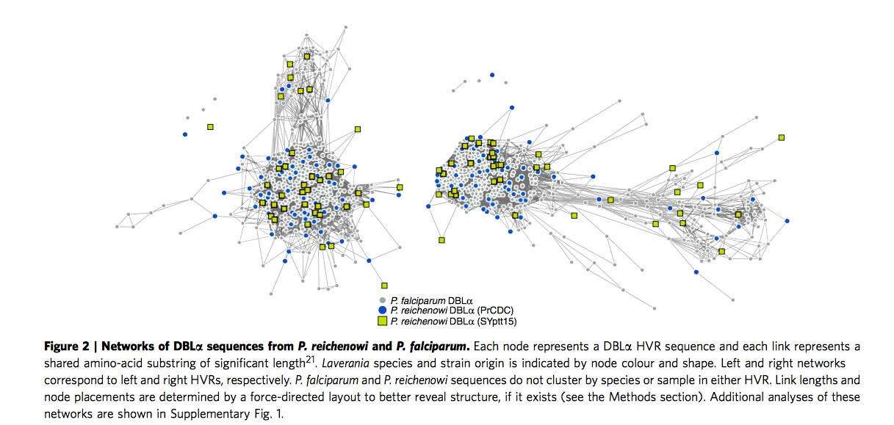
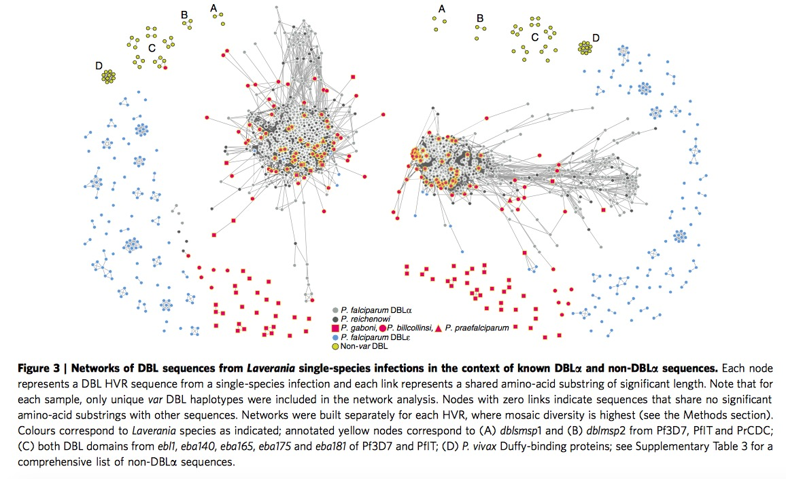
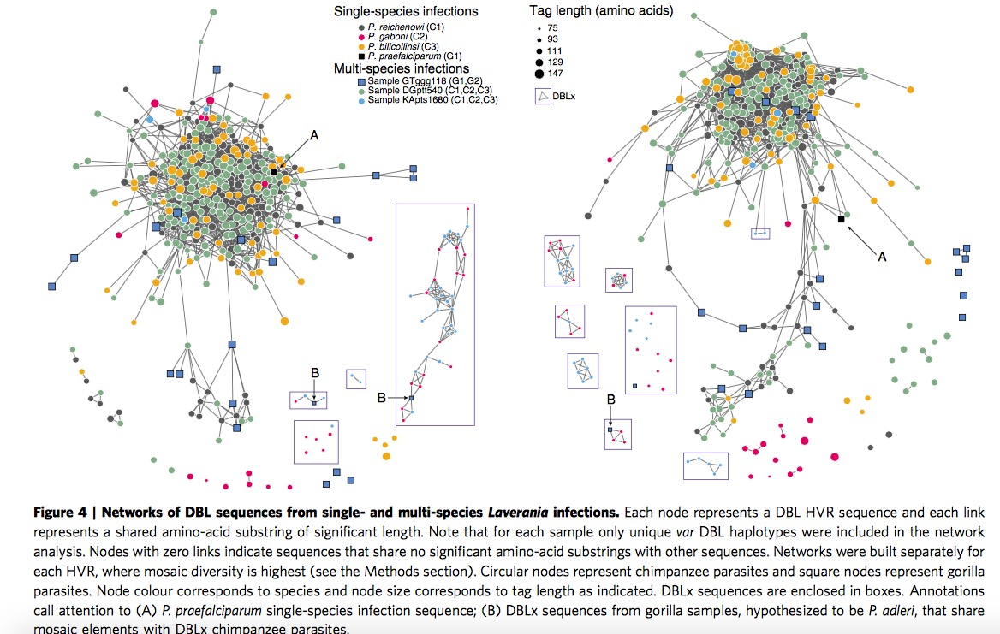
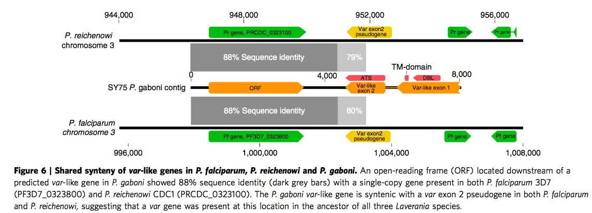
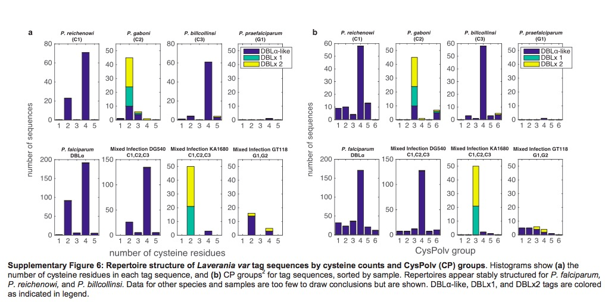

<!-- The file analysis/chunks.R contains chunks that define default settings
shared across the workflowr files. -->
```{r read-chunk, include=FALSE, cache=FALSE}
knitr::read_chunk("chunks.R")
```

<!-- Update knitr chunk options -->
```{r knitr-opts-chunk, include=FALSE}
```

<!-- Insert the date the file was last updated -->
```{r last-updated, echo=FALSE, results='asis'}
```

<!-- Insert the code version (Git commit SHA1) if Git repository exists and R
 package git2r is installed -->
```{r code-version, echo=FALSE, results='asis'}
```

<!-- Add your analysis here -->
An general biological introduction about **var** genes are as follows:

There are four parasites in total, one of them is **plasmodium**. Regarding plasmodium,  they could exist in Chimpanzees, gorillas, bird, reptiles, and even humans. There are four species of plasmodium could infect humans in nature, in addition, one is zoonotic malaria plasmodium. They are:  
**P.falciparum**: Cause of severe malaria, found in tropical and subtropical areas, infected parasites even could clog blood vessels.  
**P.vivax**: Mostly found in Asia where has high population density.  
**P.oval**: Mostly found in Africa where most people are negative for the Duffy blood group.  
**P.malariae**: Three-day cycle, former three kinds are two-day cycle.  
**P.knowlesi**: Zoonotic malaria in Southeast Asia, particular in Malaysia. 24 hour cycle leading to rapidly severe infection.

Each **plasmodium** genome encodes approximinatly 60 different PfEMP1 proteins, which are expressed from var genes, one at a time. Each var gene consists of various numbers and combinations of DBL$\alpha$ and CIDR domains. Another way of say from QixinHe, Each var gene is composed of $l$ epitopes that connected linearly, and each epitope can be viewed as a multi-allele locus with $n$ alleles.

Meiotic recombination and mitotic recombination is major mechanism of var genes.

**Meiotic recombination**: Found within mosquitos. Germ cells is produced, sexual stage of parasite.  
**Mitotic recombination**: Found in asexual blood where the parasites spend most of their life cycle. Somatic cells is produced.  
This paper shows us five conclusions as follows:

## P.r and P.f shared same modular HVR architecture
PrCDC is one previous sample from species P.r, previous study has showed the evidence for the presence of HB(Homology Blocks)in P.r and P.f. In contrast, researchers here focus on HVR(Highly variable regions) in DBL$\alpha$ domain. After the  network construction by ``webweb" tool, as shown in Figure 2 and Supplementary Figure 1, it exhibits both this two species share the same modular HVR architecture. It is further established P.r and P.f are sister taxa.



## Var DBL$\alpha$ structure are similar among the whole Laverania species

When we extend and analysis parasite sequences to the whole Laverania subjenus. From Figure 3, we can clearly see the single-infection species ( C1(P.r), G1(P.p), C3(P.b), C2(P.g) )and P.f indicate the presence of shared mosaic elements after comparing the non-var DBL domains, moreover , every Laverania var tag contains three conserved motifs separating two HVRs, indicating all species in Laverania subjenus share similar DBL$\alpha$ tag structure.

$\bigstar$ Add my thought when I read through this part: one is when we look at this Figure 3 carefully, we could find part of P.g species (red square) are far from the other P.f, P.r and P.b, remaining sequences in P.g exist in major HVR lest and right region. Apparently authors do not provide sensible explanation. The other one is if we look at the right HVR network, it is clear to notice the yellow circles are assembled in the major region particularly. According the legend, yellow circles represent non-var DBL circle, it seems not very sensible in some sense, authors even do not mention it in the paper.



## Discover DBLx domain in C2/G2 branch
Here researchers investigate all the Laverania species by constructing HVR networks but exclude P.f, in this part, C1,C3 and (C1,C2,C3) are assembled together clearly, which is consistent with previous classification. Here authors offer one illustration about the placement of P.g, the P.g appear to fall into two subgroups, longer sequence group are partially overlapping with P.r and P.b, while the shorter sequence group are far away the main part, they are given two terms respectively, DBL$\alpha$-like and DBLx-like.

Then look at the samples of single-infection P.g and multi-species infection GTggg118(P.p and P.a), they discover both of them contain DBLx sequences from networks shown in Figure 4, they thus hypothesize DBLx found in GTggg118 comes from P.a, which is a sister taxa of P.g. Hence, it is highly likely DBLx sequences is a new subdomain in C2/G2 branch of Laverania radiation.



## Multi-domain structure shared among the whole Laverania species
There are two parts in this section. First part tells us the presence of var TAS domains in P.g by identifying 7 of 10known major HBs in P.f and P.r via VarDom server. The details are in Figure 5. In another story, based on Figure 5, ORF(Open reading Frame) share 88% nucleotide sequence identity with P.f and P.r in same chromosome 3. Apart from that, exon 2 is a single-copy of var exon2 pseudogene on chromosome 3 of both P.f and P.r. All these clues imply the existence of ancestral ORF and two-exon var structure.



## CP group classification in P.f and P.r could extend to P.b
It has been previously published var genes could divided into two main group based on the number of cysteine residues, then according to the presence or absence of key amino acid residues, these two main group could be further subdivided into a total of six CP groups. Different groups are associated with different clinical phenotypes. Based on Supplementary Figure 6, we could find the P.b also exhibit same organization,  both with cysteine residues count and CP groups. P.g are sot sufficiently to infer since it is lack of enough DBL$\alpha$-like motifs. 

 

Another two interesting points I need add is the identification of HVR and Bayesian K-mer analysis. Researchers identified HVRs using a sequence entropy approach, aligning HB3 firstly, then compute Shannon entropy and choose sequences which entropy was more than 2 bits, then repeat same step in HB5, last is HB2. Bayesian K-mer analysis is employed to estimate the overlap for global populations of P.f and P.r instead of between species for our currently available datasets. The overlap parameter $p$ is views as beta distribution with parameters $\alpha$ and $\beta$, then calculate these two parameters by maximizing the log-likelihood.  

Lastly, one note: the whole structure of this paper is kind of different with normal publications. Authors place Result in front of Methods, and Methods are printed in smaller font size.

