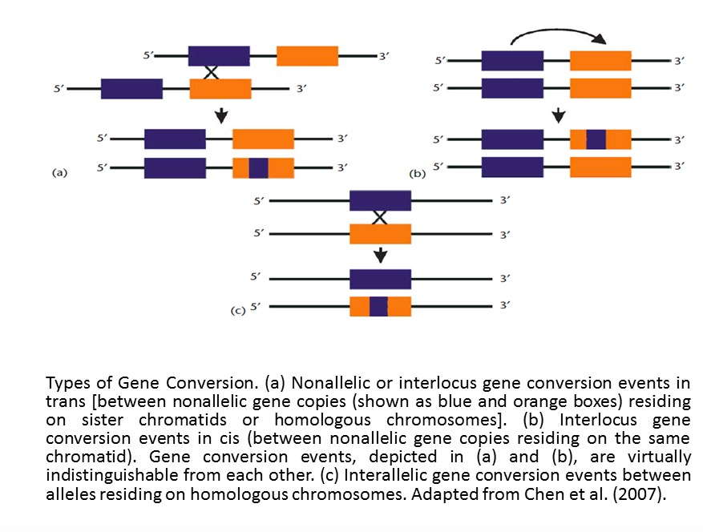
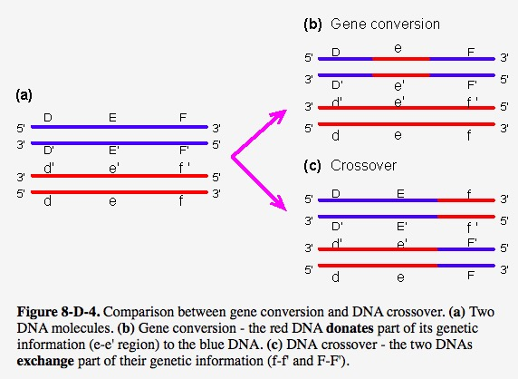
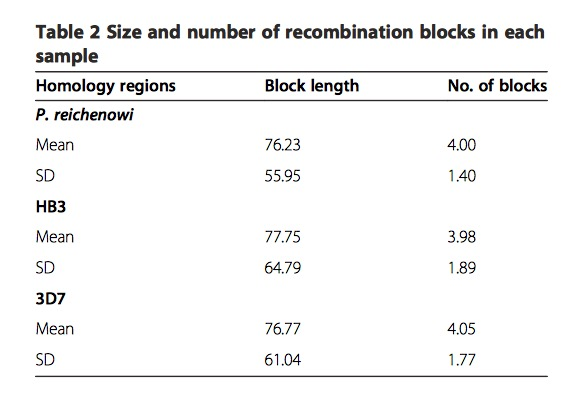

<!-- The file analysis/chunks.R contains chunks that define default settings
shared across the workflowr files. -->
```{r read-chunk, include=FALSE, cache=FALSE}
knitr::read_chunk("chunks.R")
```

<!-- Update knitr chunk options -->
```{r knitr-opts-chunk, include=FALSE}
```

<!-- Insert the date the file was last updated -->
```{r last-updated, echo=FALSE, results='asis'}
```

<!-- Insert the code version (Git commit SHA1) if Git repository exists and R
 package git2r is installed -->
```{r code-version, echo=FALSE, results='asis'}
```

<!-- Add your analysis here -->
In this paper, using a novel HMM-based approach, researchers compare sequences of var gene DBL$\alpha$ domains from two divergent isolates in P.falciparum: 3D7 and HB3, and its sister taxa P.reichenowi. Results demonstrate this two species share similar gene size, and gene structure. To more specifically, they both have more than 51 var genes in a genome, and they both have a series of "homology blocks". In addition, through simulation, they found recombination occurs almost every residue in DBL$\alpha$ domain which appears to be unusual, and no hotspot structure for this type of intradomain recombination even though interdomain hotspot structure could be considered in previous Rask's study.

High level of sequence diversity in the PfEMP1 proteins, encoded by 50 to 60 var genes, express on the surface of infected red cells, provoking an immune response, and are known virulence factors. Previous studies show that recombination, combined with point mutation, is the mechanism of var gene revolution. Another noteworthy point is that since host's immune system is more effective against antigens, as a result, parasites expressing less-common proteins avoid detection more effectively.
 
DBL$\alpha$ domain, averaging 1.8kb in length, is the only functional domain in P.falciparum and P.reichenowi, and it has stable location as well.    

Using the tBLASTx algorithm and the prototype DBL$\alpha$ domain, researchers are able to extract reads, then using Clean Data assembly algorithm in Sequencer(GeneCodes), 51 unique DBL$\alpha$ regions are recovered, which is within the range of P.falciparum, thus, demonstrating that the family is equally large in both species. In further phylogenetic analysis of the var gene DBL$\alpha$ domains, P.reichenowi are not clustered together, indicating var genes likely arose as an entire family before the P.falciparum-P.reichenowi speciation event 2.5-6 million years ago.

Before introduction of method part, there are two pictures showing us the difference of gene conversion and crossover.



*This graphic is adapted from Chen et al.(2007)*



*This graphic is adapted from [webbook](http://www.web-books.com/MoBio/)*

Obviously, gene conversion in second figure belongs to the third type (Interallelic gene conversion)shown in first figure.

New method is necessary to identify the relationship between species. In this paper, **Tesserae** program written in C language is used and implemented. HMM is employed to find homology, global alignment algorithm (Needleman-Wunsch) is to detect mosaic recombination, product of approximately conditionals (PAC) likelihood is utilized to estimate the recombination parameter. This paper aim to reconstruct each sequence in dataset as a mosaic of one or more donor sequences, allowing substitution, indel and recombination. The precise steps are as follows:

Initially, recombination parameter set to zero, transition and emission probabilities , indels and mutations are  estimated using Baum-Welch algorithm, then fix these parameters, a likelihood surface is constructed for the recombination parameter. Once MLE for recombination parameter is found, Viterbi path is computed for each sequence, this path provide the mosaic alignments.

For simulated sequences, they construct 10 gene families, each family has 60 genes, each gene is composed of 150 amino acid residues in length, and a table of input parameters are needed. Each gene family is used for 8 different sets of parameters, namely, different levels of recombination and conversion. Each gene family's simulation could viewed as two groups, one is indels without recombination, another one is coalescent with recombination, since there is currently no available program for joint estimation about recombination and indel. 

Here we have to note that the coalescent is likely to be an inaccurate description of the true var gene evolution. However, basic coalescent processes of coancestry and allelic recombination may represent var gene duplication and non-allelic recombination, thus, making aspects of coalescent represent several features of var gene family evolution. Here authors employ calibration method, allowing them to make comparisons between the $\rho$ and recombination parameter in coalescent models.

Firstly, comparisons of the exact values show a high level of accuracy in the estimated recombination rates, through computing the difference of likelihood with and without recombination for each sequence, the statistical significance of the improvement as p less than $1*10^{-32}$.

In order to test false positives further, they uses a non-recombining data from P.falciparum, the program is able to recover all known recombination event, while finding no recombination history, as expected.

In further examination of the P.falciparum and P.reichenowi DBL$\alpha$ domain homology regions,  researchers find multiple regions pf particular high homology, classified into two groups: core motifs and conserved peptides. The former one is between 18 and 28 residues, corresponding to HB1-5(termed ``homology blocks" by Rask et al.), among them, HB2 motif are he most frequently ones, then is HB3 and HB5. The latter one is between 24 and 140 residues, and between 80% and 100% similarity.

Lastly, the most important analysis result is recombination is uniform throughout the DBL$\alpha$ domain and does not show a hot- or coldspot structure, that means recombination breaks at almost every residue. From the following table, high variance of block length indicate the lack of hot - or coldspots of recombination.



*This table is adapted from original paper*
